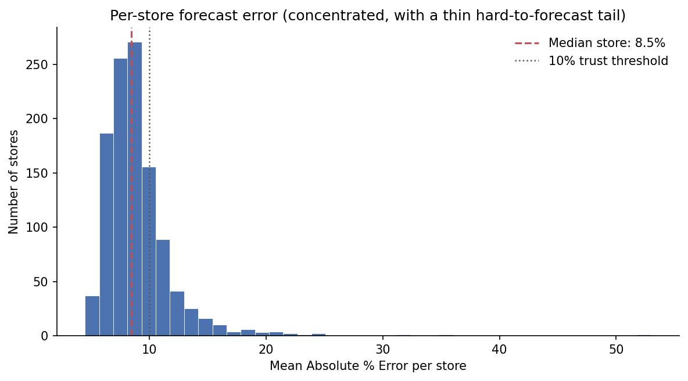

# Rossmann Store Sales Forecasting

Forecasting daily sales across 1,115 Rossmann stores with LightGBM and translating the model into honest business terms: what the error means in euros, what the business can actually act on, and where the model should *not* be trusted.

**Headline:** ~46% reduction in forecast error versus a naive baseline (RMSPE 0.236 → 0.124), with documented per-store reliability and trust boundaries.



*Per-store error is concentrated. Most stores forecast within 10% mean error, with a thin tail of hard-to-forecast stores. The headline metric is driven by that tail.*

---

## Results at a glance

| Metric | Value | What it means |
|---|---|---|
| RMSPE (deployed, latest window) | **0.124** | ~46% below baseline |
| RMSPE (cross-validated mean) | 0.126 | expected performance, range 0.121–0.134 |
| Naive baseline RMSPE | 0.236 | mean sales per Store/DayOfWeek |
| Typical-day error (median APE) | ~6.8% | what to expect on a normal store-day |
| Euro error, median store (~€6,400/day) | ~€440 vs ~€1,000 baseline | forecast *error magnitude*, not money saved |

The headline RMSPE is roughly double the typical-day error because a thin tail of hard store-days dominates the squared metric. The model is reliable for normal operations and degrades on structural anomalies; a distinction the project documents.

---

## Project structure

End-to-end pipeline across five notebooks, run in order:

| Notebook | Purpose |
|---|---|
| `01_eda.ipynb` | Exploratory analysis; sales trends, day-of-week, promotions, store types, competition |
| `02_preprocessing.ipynb` | Cleaning, feature engineering, handling missing competition data |
| `03_modeling.ipynb` | LightGBM baseline and first models |
| `04_eval_tuning.ipynb` | Time-based cross-validation, tuning to a defensible plateau |
| `05_business_interpretation.ipynb` | Translating metrics into business meaning, trust boundaries, limitations |

```
.
├── notebooks/        # 01–05, run in order
├── outputs/
│   ├── figures/      # EDA + results visuals
│   └── models/       # lgbm_final.txt (trained LightGBM booster)
├── requirements.txt
└── README.md
```

---

## How to reproduce

```bash
python -m venv venv && source venv/bin/activate   # Windows: venv\Scripts\activate
pip install -r requirements.txt
```

Key dependencies: `lightgbm`, `pandas`, `numpy`, `fastparquet`, `matplotlib`, `scikit-learn`.

**Data:** the Rossmann Store Sales dataset is not committed. Download it from the [Kaggle competition page](https://www.kaggle.com/c/rossmann-store-sales) and place the raw files under `data/`. Notebook `02_preprocessing` produces the cleaned `data/processed/rossmann_clean.parquet` that the later notebooks read.

Run the notebooks in numerical order; each re-reads the cleaned data from scratch.

---

## Approach notes

**Validation is time-based.** In forecasting, a random split leaks future information into the past. Splits and cross-validation folds are strictly chronological, i.e., the model is only ever validated on dates it was not trained on.

**The target is log-transformed.** Training on `log1p(Sales)` (back-transformed with `expm1`) makes percentage errors more symmetric and stabilized validation across folds, particularly for smaller stores, where absolute errors are small but percentage errors can be large.

**Tuning stopped at a defensible plateau.** Each tuning lever bought progressively less; once additional regularization stopped improving CV error, tuning stopped.

---

## Key business insight: promotions are the main controllable lever

Store identity accounts for the largest share of model importance (~71% of gain), but a store's identity isn't something the business can change. The largest *controllable* factor is **promotions** (~14% of gain).

In the data, comparing promo to non-promo days *within the same weekday*, promo days show roughly **23–64% higher sales** (averaging ~41%), with the largest relative lift early in the week (partly because early-week baseline traffic is naturally lower).

**Important:** this is an observed *association*, not a causal effect. Stores choose when to promote, so the promo flag is entangled with whatever drove that decision. Estimating the true return on promotions would require an experiment model. A recommended next step, not a claim this analysis can make.

---

## Where this model can and cannot be trusted

**Trust is not uniform across stores.** The median store is forecast to ~8.5% error and ~77% of stores fall within 10%, but a tail of stores reaches ~53% error. The model is reliable for the operational core and degrades on a minority with irregular patterns.

**It is blind to structural events.** The model forecasts *normal trading*. It cannot anticipate breaks it has no feature for. Two stores that ceased trading mid-validation were excluded. Recommendation: flag stores with anomalous recent trajectory for human review rather than acting on the forecast blindly.

---

## Limitations

- **No validated holiday-season performance.** The model trains on two Decembers (2013, 2014) but is validated only on a June–July 2015 window. So while it has learned holiday patterns, its accuracy on December demand has never been measured.
- **Trend–volume confound in cross-validation.** Error improved across later CV folds, but later folds had both more training data and different seasonality. These effects point the same way and cannot be separated under this design.
- **Store importance is partly an artifact.** With 1,115 store categories, high-cardinality features attract split importance mechanically. Store identity is real signal, but the 71% figure overstates its interpretive weight.
- **Forecast error is not money saved.** Euro figures report error *magnitude*. Realized financial value depends on inventory, margin, and spoilage economics not present in this dataset.

---

## Possible future work

- Acquire a full year-plus of data including December for genuine cross-season validation; the single highest-leverage improvement.
- Experimental analysis to estimate true promotional ROI.
